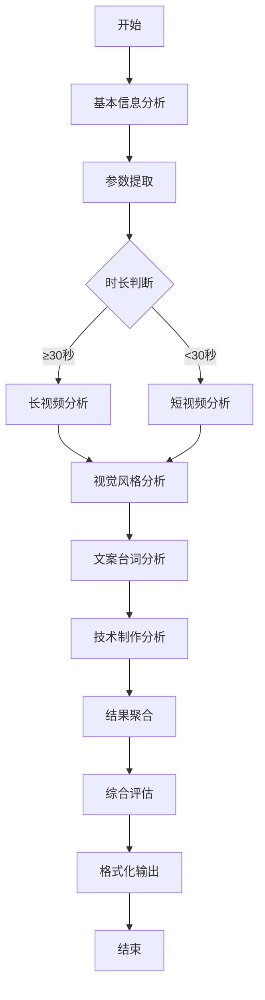

# 📁 DSL文件夹 - Dify工作流配置

本文件夹包含各种专业的Dify工作流DSL配置文件，可以直接导入到你的Dify平台使用。

## 🎬 短视频分析工作流

### 文件：`短视频分析工作流.yml`

这是一个专业的短视频内容分析评估工具，能够从多个维度全面分析短视频质量。

#### 📋 分析维度

**核心分析指标：**
1. **故事连贯性分析** - 情节逻辑、转折设置、主线副线关系
2. **画面风格统一性** - 色彩搭配、构图质量、视觉一致性
3. **文案台词吸引力** - 语言表达力、情感共鸣点、开头Hook设计
4. **画质清晰度** - 分辨率评估、噪点控制、压缩质量
5. **技术制作水平** - 剪辑技术、音频处理、后期特效

**进阶分析功能：**
- 🔍 **智能时长判断** - 根据视频时长自动选择分析策略
- 📊 **参数自动提取** - 从视频中提取关键技术参数
- 🎯 **针对性建议** - 基于视频类型提供定制化优化建议
- 📈 **综合评分系统** - 五大维度100分制专业评分

### 🚀 使用方法

#### 1. 导入工作流
1. 登录你的Dify平台
2. 进入工作台，选择"导入DSL文件"
3. 上传 `短视频分析工作流.yml` 文件
4. 配置你的模型（推荐使用GPT-4o或Claude-3.5）

#### 2. 配置输入参数
工作流支持以下输入：
- **视频文件** - 支持多种格式的短视频文件
- **视频类型** - 选择最符合的类型（剧情、教育、产品展示等）
- **分析需求** - 描述你的具体关注点（可选）

#### 3. 获取分析报告
工作流将生成包含以下内容的专业报告：
- 📊 五维度评分（满分100分）
- 🚨 紧急改进项目
- ⭐ 重要优化建议
- 🎯 长期提升方向
- 💡 具体执行方案

### 🔧 工作流架构



### 📊 分析示例

#### 输入示例：
- **视频类型**：教育类
- **文件**：5分钟的Python教学视频
- **分析需求**：希望提升学生的观看完成率

#### 输出示例：
```
🎬 短视频专业分析评估报告

📊 评估概览
- 故事连贯性：85分
- 画面风格统一性：78分  
- 文案台词吸引力：92分
- 画质清晰度：88分
- 技术制作水平：82分
- 综合得分：85分

🚨 紧急改进项
- 部分画面存在轻微抖动，影响观看体验
- 字幕与语音同步度需要优化

⭐ 重要优化项  
- 增加更多视觉图表来辅助理解
- 优化开头3秒的吸引力设计
```

### 💡 最佳实践建议

#### 视频准备：
1. **文件格式**：推荐MP4格式，确保平台兼容性
2. **文件大小**：建议50MB以内，保证上传速度
3. **视频质量**：720p以上分辨率，便于视觉分析

#### 分析策略：
1. **明确目标**：在"分析需求"中清楚描述关注重点
2. **类型选择**：准确选择视频类型，获得更精准的建议
3. **多次迭代**：可以针对优化后的视频重新分析对比

### 🔄 工作流优化

本工作流采用了以下Dify高级特性：

- **条件分支**：根据视频时长智能选择分析策略
- **参数提取**：自动从LLM分析中提取结构化数据
- **变量聚合**：整合多个分析节点的结果
- **模板转换**：格式化输出专业报告
- **视觉识别**：启用GPT-4o的视觉分析能力

### 📈 扩展应用

这个工作流可以进一步扩展为：

1. **批量分析工具** - 使用迭代节点处理多个视频
2. **实时评分系统** - 集成到内容创作平台
3. **A/B测试工具** - 对比不同版本的视频效果
4. **团队协作平台** - 多人共同评估和改进视频

### ⚠️ 注意事项

1. **模型选择**：建议使用支持视觉功能的模型（如GPT-4o）
2. **文件限制**：注意平台的文件大小和格式限制
3. **成本控制**：大模型调用会产生Token消耗，建议合理使用
4. **隐私保护**：敏感内容建议使用本地部署的Dify

---

## 🤝 贡献指南

欢迎提交更多实用的工作流DSL文件！

### 提交规范：
1. 文件命名：使用中文描述功能 + `.yml`
2. 添加详细的节点注释和描述
3. 在README中补充使用说明
4. 提供示例输入输出

### 质量标准：
- ✅ 完整的工作流逻辑
- ✅ 清晰的输入输出定义  
- ✅ 专业的Prompt设计
- ✅ 合理的节点布局
- ✅ 详细的使用文档

---

**维护者：** DifyWorks团队  
**最后更新：** 2025-01-09  
**版本：** v1.0 