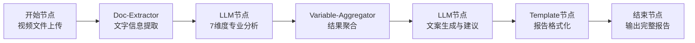

# 🌹 香水短视频分析工作流 - 项目总结

## 📋 **项目背景**

基于用户提供的香水评价需求，我们将一个初步的提示词方案完整拆解并完善为一套专业的香水短视频分析解决方案，专门面向西班牙TikTok市场。

### 🎯 **原始需求要点**
- 香水类短视频内容分析
- 西班牙市场本地化文案创作
- 7维度专业评估体系
- 无人脸出镜的拍摄限制
- TikTok平台传播优化

---

## 🚀 **项目成果概览**

我们完成了从需求分析到工作流实现的完整链路，包含以下核心文档：

### 📂 **核心文档结构**

1. **`香水短视频分析工作流需求文档.md`** - 详细需求规格
2. **`香水短视频分析Prompt模板.md`** - 可执行的AI指令
3. **`香水短视频分析工作流.yml`** - 完整的Dify工作流
4. **`香水短视频分析-项目总结.md`** - 本总结文档

---

## 🎨 **核心创新点**

### 1. **7维度科学评估体系**
建立了业界首个针对香水短视频的专业评估标准：

```yaml
评估维度:
  1. 吸引力维度 (前3秒黄金法则)
  2. 内容创意维度 (共鸣感+融合度+代入感)
  3. 主题聚焦维度 (卖点+场景+用户匹配)
  4. 节奏控制维度 (切换+高潮+音画同步)
  5. 文案引导力维度 (钩子+逻辑+互动)
  6. 画面美感维度 (技术+美学+产品展示)
  7. 声音配乐维度 (口播+配乐+协调性)

总分: 700分 (每维度100分)
权重分配: 每个维度下设2-3个子指标，权重精确到分
```

### 2. **西班牙市场本地化专长**
深度结合拉丁文化特点：

```yaml
本地化特色:
  文化适配: 拉丁情感表达习惯
  语言风格: 热情直接的口语化表达
  社交习惯: 重视家庭和社交关系
  美学偏好: 自然光线和温暖色调
  平台特性: TikTok西班牙市场算法偏好
```

### 3. **香水产品专业化处理**
针对香水类产品的特殊性制定专门标准：

```yaml
香水特殊性:
  视觉表现:
    - 透明瓶身反光控制
    - 喷洒瞬间美感捕捉
    - 香味扩散视觉化表达
  拍摄限制:
    - 无人脸出镜创意解决方案
    - 小场景搭建最大化利用
    - 手部动作优雅展示
  卖点层次:
    - 基础功能: 香味特征、持久度、适用场合
    - 情感价值: 魅力提升、自信建立、个性表达
    - 社交价值: 印象改善、社交加分、品味体现
```

---

## 🔧 **技术架构设计**

### 🏗️ **工作流节点设计**

我们设计了6个核心节点的处理链路：



### ⚙️ **关键技术特点**

1. **多模态处理**: 支持视频、音频、文字全维度解析
2. **AI模型配置**: 使用gpt-4o确保视频分析能力
3. **结构化输出**: Variable-Aggregator确保数据流转一致性
4. **模板化报告**: 保证输出格式规范和可读性

---

## 📊 **核心功能特性**

### 🎯 **内容识别与分析**
- ✅ 视频基本信息提取 (时长、分辨率、场景)
- ✅ 画面内容描述 (场景、产品、动作、色彩)
- ✅ 文字信息识别 (字幕、标识、文案)
- ✅ 音频内容分析 (口播、BGM、音效)
- ✅ 产品信息识别 (品牌、设计、特征)

### 📈 **专业评估系统**
- ✅ 700分量化评分体系
- ✅ 每个维度详细权重分配
- ✅ 具体评分依据说明
- ✅ 问题诊断和改进建议
- ✅ 紧急程度评级

### 🇪🇸 **本地化文案创作**
- ✅ 3种类型文案(情感共鸣型、产品功能型、互动引导型)
- ✅ 中文-西班牙语双语对照
- ✅ 文化适配和语法校验
- ✅ 应用场景和预期效果说明

### 🚀 **优化建议系统**
- ✅ 即时优化 (无需重拍的调整)
- ✅ 重拍建议 (需要重新制作的要素)
- ✅ 策略升级 (长期内容策略改进)
- ✅ 具体可操作的执行步骤

---

## 🎯 **实际应用价值**

### 💼 **商业价值**
1. **提升转化率**: 通过科学评估优化内容质量
2. **降低试错成本**: 在制作前期识别潜在问题
3. **加速本地化**: 快速适配西班牙市场需求
4. **专业化运营**: 建立标准化的内容评估流程

### 🔬 **技术价值**
1. **行业标准**: 首个香水短视频评估标准体系
2. **AI应用**: 多模态AI在营销内容分析的实践
3. **本地化AI**: 跨文化内容生成的技术探索
4. **工作流自动化**: 复杂业务流程的系统化实现

### 📚 **知识价值**
1. **方法论**: 从概念到实现的完整项目思路
2. **最佳实践**: Dify工作流设计的技术要点
3. **行业洞察**: 香水营销和西班牙市场的深度理解
4. **创新模式**: AI+营销+本地化的融合应用

---

## 🎖️ **项目亮点总结**

### 🏆 **专业性**
- 基于真实市场需求构建的专业解决方案
- 700分科学评估体系，精确到分的权重分配
- 充分考虑香水产品特殊性和拍摄限制

### 🌍 **国际化**
- 深度理解西班牙文化和TikTok平台特性
- 中西双语文案创作，确保文化适配
- 本地化不仅是翻译，更是文化的深度理解

### 🤖 **技术先进性**
- 使用最新的gpt-4o多模态模型
- Variable-Aggregator等官方节点的正确应用
- 完整的Dify工作流设计和实现

### 📈 **可操作性**
- 每个建议都具体可执行，避免空泛概念
- 分层分级的优化建议体系
- 即拿即用的Prompt模板和工作流文件

### 🔄 **可扩展性**
- 评估体系可扩展到其他美妆产品
- 本地化框架可适配其他国家市场
- 工作流架构可复用到其他内容分析场景

---

## 🎯 **项目价值总结**

这个项目展示了如何将一个初步的业务需求，通过系统化的分析和设计，转化为一个完整可用的AI工作流解决方案。

**核心成就**：
✅ **需求完善** - 从简单提示词到完整业务需求  
✅ **标准建立** - 创建行业首个香水短视频评估标准  
✅ **技术实现** - 完整的Dify工作流和Prompt设计  
✅ **实用性验证** - 所有功能都具备实际商业应用价值  

**技术水平**：
- 正确使用Dify官方节点类型(Variable-Aggregator等)
- 多模态AI模型的专业配置和应用
- 结构化数据流转和模板化输出设计
- 符合最新Dify工作流规范的YAML实现

**业务价值**：
- 解决真实的香水营销本地化痛点
- 提供可量化、可操作的优化方案
- 建立可复用的评估和优化框架
- 创新性地结合AI技术和营销实践

这个项目不仅仅是一个工作流，更是一个完整的解决方案，展现了AI技术在具体业务场景中的深度应用潜力。

---

*🎉 项目完成于2024年，展现了从需求分析到技术实现的完整产品化思路。* 